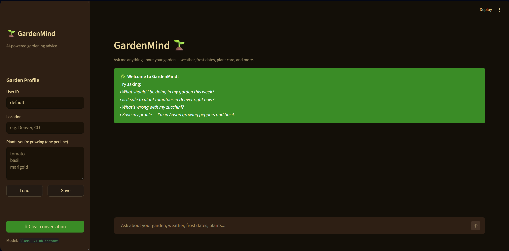
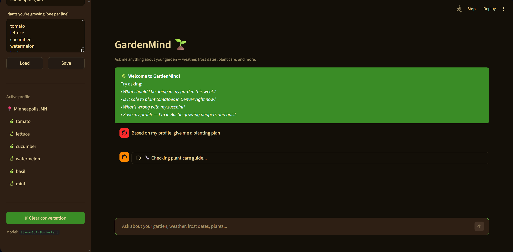
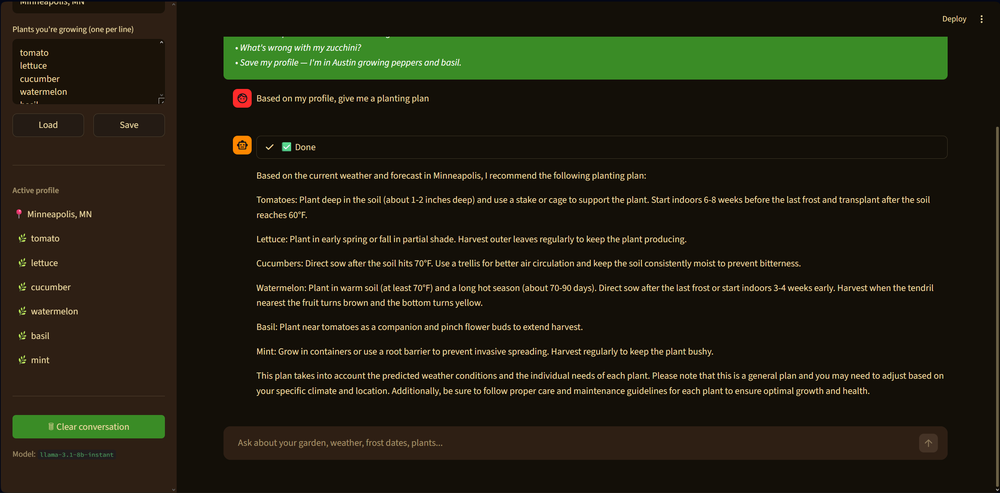

# GardenMind 🌱

GardenMind is an AI-powered gardening assistant that gives personalized, weather-aware advice based on your location, what you're growing, and real-time conditions. Ask it anything — whether to plant tomatoes this weekend, what's wrong with your zucchini, or when your last frost date is.

Built with [Groq](https://groq.com) (llama-3.1-8b-instant), [OpenWeatherMap](https://openweathermap.org/api), and [Streamlit](https://streamlit.io).

## Demo

| Welcome state | Live tool calls | Final response |
|---|---|---|
|  |  |  |

## Features

- **Real-time weather** — current conditions and 5-day forecast for any city
- **Frost date lookup** — USDA average last spring / first fall frost for ~60 US cities
- **Plant care library** — watering, sun, temperature, and problem-solving info for 200 plants
- **Garden profiles** — save your location and plant list; the agent reads it automatically
- **Multi-step reasoning** — the agent chains tools together to give holistic advice
- **Tool transparency** — the UI shows every tool call and result in real time

## Tools

The agent has 6 tools it can call during a conversation:

| Tool | Description |
|------|-------------|
| `get_current_weather` | Live OWM call — temp, humidity, rainfall, wind, UV index |
| `get_forecast` | 5-day forecast with daily high/low and rain probability |
| `get_frost_dates` | Average last spring / first fall frost for a US city |
| `lookup_plant_care` | Watering, sun, temp tolerances, and planting notes for a plant |
| `get_garden_profile` | Load a user's saved garden profile |
| `update_garden_profile` | Save or update a user's garden profile |

## Architecture

```
ui/app.py          — Streamlit chat interface
agent.py           — Groq tool-use loop and tool dispatch
tools/
  weather.py       — OpenWeatherMap API (current + forecast)
  frost.py         — Static USDA frost date table (~60 US cities)
  plants.py        — Plant care lookup from data/plants.json
  profile.py       — Per-user profiles (data/profiles/{user_id}.json)
data/
  plants.json      — 200 plants with care metadata
  profiles/        — User profile files (gitignored)
evals/
  test_cases.json  — 25 eval scenarios
  run_evals.py     — Eval runner with category scoring
```

## Setup

### 1. Clone and install dependencies

```bash
git clone https://github.com/dcass5212/gardenMind.git
cd gardenMind
pip install -r requirements.txt
```

### 2. Get API keys

- **Groq** — free at [console.groq.com](https://console.groq.com)
- **OpenWeatherMap** — free tier at [openweathermap.org/api](https://openweathermap.org/api)

### 3. Create a `.env` file

```
GROQ_API_KEY=your_groq_key_here
WEATHER_API_KEY=your_openweathermap_key_here
```

### 4. Run the app

```bash
py -m streamlit run ui/app.py
```

## Environment Variables

| Variable | Description |
|---|---|
| `GROQ_API_KEY` | Groq API access (required) |
| `WEATHER_API_KEY` | OpenWeatherMap API key (required) |

## Evals

```bash
py evals/run_evals.py
```

Current results: **20/25 (80%)** on `llama-3.1-8b-instant`. See [EVALS.md](EVALS.md) for the full breakdown by category.

## Deployment (Streamlit Cloud)

1. Push this repo to GitHub (make sure `.env` is in `.gitignore`)
2. Go to [share.streamlit.io](https://share.streamlit.io) and connect the repo
3. Set **Main file path** to `ui/app.py`
4. Under **Settings → Secrets**, add:
   ```toml
   GROQ_API_KEY = "your_groq_key"
   WEATHER_API_KEY = "your_openweathermap_key"
   ```
5. Click **Deploy**

## What I'd Build Next

- **Planting calendar** — personalized schedule based on location and frost dates
- **Image diagnosis** — upload a photo of a sick plant for visual problem identification
- **More cities** — expand frost date coverage or integrate a live USDA API
- **Frost/rain alerts** — push notifications for upcoming weather risks
